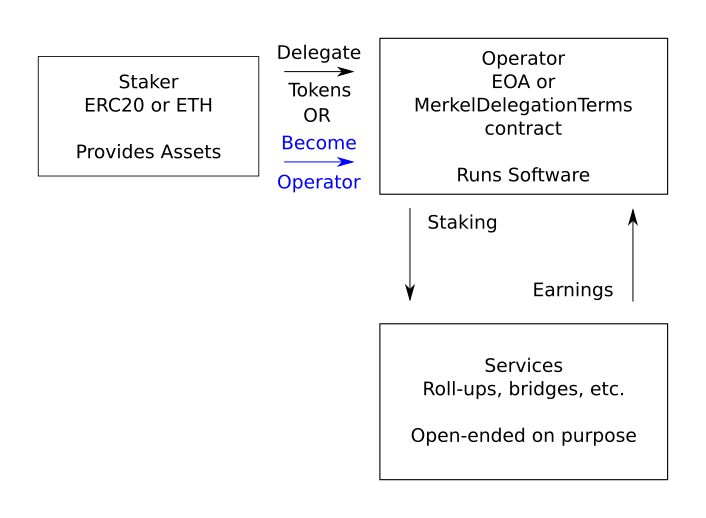
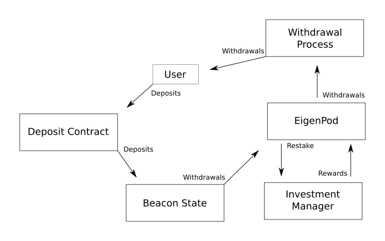
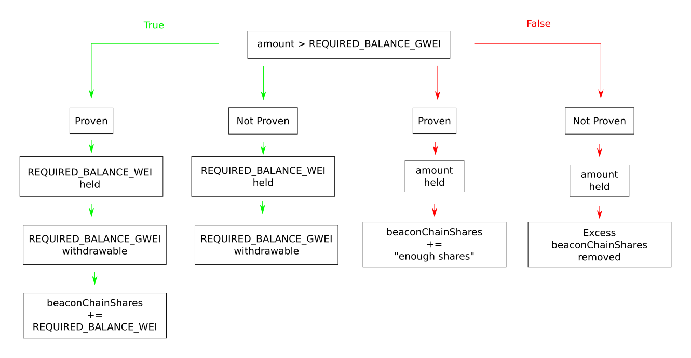
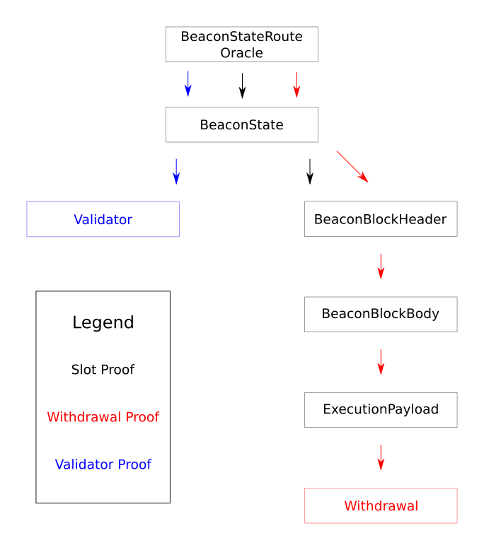

# EigenLayer Audit Notes

Conducted 2 audits - **Eigenvalue Diligence & Sigma Prime**

Only 1 medium severity & 1 high severity found in both of them.

## Areas of Focus:

### General

- Loss of user funds
- Enforced delays on withdraw

### Beacon Chain, Execution Layer

- Eigenpods - connects beacon chain to execution layer for "native restaking" of ETH. 
   - Existing/new ETH validators who don't hold liquid staked tokens, but just directly stake ETH on Beacon Chain can restake on EigenLayer. Pointing withdraw credentials to one of the `EigenPod` contracts. Oracle later, out of scope. 
   - Still, lots of functionality in EigenPods to check merkalized proofs against the oracle state roots - want assurance that they've done this correctly. 

## Restaking

Restaking is the process of taking a staked asset, and staking it again. E.g., a user may stake ETH for stETH and then stake stETH within EigenLayer.

- Restaked assets are controlled by EigenLayer
   - This can be used by rollups, bridges, etc.
        - Essentially acts as a backing of collateral.

Slashing can occur when a user is acting maliciously, enabling services to slash some of the users deposited funds.

- EigenLayer is permissionless
    - Anyone can be a staker, consume a service, or create their own service
    - Being an operator for a service is **opt-in**.
        - Being a staker is **opt-in** as well, and can commit to chosen services (1 or more)
            Stakers may also delegate their stake to an operator that they trust.

- New services built on EigenLayer can determine their own slashing conditions
    - On-chain verifiable conditions

## Actors
**Stakers** are the party with the asset. Mix of ERC20 tokens, ETH, etc.

- @audit We need to check for:
    - Correctness with asset depositing
        - Contract handles staked deposits correctly
    - Delegation mechanism
        - Secure, intended functionality

**Operators** are the users who run the software built on EigenLayer. Stakers may delegate their assets to operators, which selects certain services to service.

- @audit We need to check for:
    - Registration is nontamperable
        - Someone else cannot register you
        - Cannot take another's registration
    - opt-in secure
        - Access control
        - Cannot opt someone else in
    - Ensure that the slashing is done correctly
        - Fairly done
        - Implemented as intended by the services

**Watchers- Future implementation** parties reliable for observing "rolled-up" claims (Not supported yet) and step in to invalidate a false claim. Essentially the operators supervisor.

- @audit We need to check for:
    - Fraudproof period enforcement
        - Allow enough time for watcher to disprove claims
    - Punishment mechanisms
        - Fair, effective, restrictive

In summary, a staker delegates their stake to an operator, who then allocates the assets to secure one or more services. Each service defines tasks, which represent time-bound units of work or commitment, during which the operator's stake is at risk. Operators are responsible for fulfilling their obligations in each task, ensuring that they adhere to the requirements and conditions set by the service.

## Assumptions
**Discretization of tasks** Assuming the service will be in charge of discretizing the tasks.

- Check the task periods, make sure there are no unfair advantages.

**Delegation "trust network" structure** Assuming that stakers are delegating their assets to operators that they trust well. Operators will be able to steal all of the funds.

**Noncompromise of trusted roles** Assuming all trusted roles (multisig, etc.) will be trustworthy.

**Honest Watcher Assumption** Assuming at least one honest watcher to fraudproof all false claims.

## Contract Overview

### `StrategyManager`

`StrategyManager` is the primary contract - this is what users will be sending their tokens to. It then sends funds to the `Strategy` contracts, which may then move the assets outside of Eigenlayer to earn returns.

- @audit Examining the interactions between the StrategyManager and Strategy contracts to ensure secure and accurate transfer of restaked assets. 
- @audit Ensuring that the strategies do not introduce additional risks or vulnerabilities to the system.

Withdraws and undelegations will go through the `StrategyManager` contract.

- @audit Make sure there are delays!
    - funds "at stake" cannot be undelegated or withdrawn
    - We cannot know immediately if funds are at stake, thus delay
    - Users enter the queued withdrawal process
        - Begin the withdrawal, signaling not to be placed "at stake"
            - @audit Make sure this happens! There should be a flag or something.
        - Push updates to services (or have their operator do it)
        - Complete withdrawal after delay
            - @audit Is this delay enough? Do we have to push updates to the services?
            - @audit Is it possible to begin the withdrawal, not push updates, and withdraw the funds before getting slashed?

### `DelegationManager`

`DelegationManager` will handle if stakers register to be operators or if they will delegate their stake to another operator.

- @audit Examine proper tracking of delegated assets, accurate assignment of tasks, and appropriate slashing conditions.
- Funds earned may be sent to a `DelegationTerms`-type contract (or EOA)
    - Helps mediate the relationships between staker & operator
    - @audit Check if this is a requirement & implemented correctly:
        - If it is not EOA, ensure delegation terms are conducted properly
            - Tracking and management of delegation relationships
            - Proper handling of payment & mediation
        - If it is EOA, is that handled properly?

- `DelegationManager` works closely with `StrategyManager`.
    - Keeps track of all operators (@audit make sure this is done correctly)
        - Storing the delegation terms for each operator
        - Stores what operator each staker is delegated to
    - Staker becomes operator **irrevocably**
        - Operator is defined as `delegationTerms[operator]` not returning 0 address
            - @audit Lost funds if human error - consider ACK scheme
            - @audit Can we change another users return?
    - Undelegation needs a delay or clawback mechanism
        - @audit Check to make sure that this is implemented properly
        - @audit Can we find a way to undelegate while funds are staked?

### `Strategy`

`Strategy` contracts each manage a single ERC20 token. Each users holdings in the strategy should be reflected by how many shares they have.

- `Strategy` is in charge of defining methods of converting from `underlyingToken` and shares(and vice versa).
    - @audit Make sure this works, and that the shares match the `underlyingToken` conversions
- Assets 'may' be depositable & withdrawable in multiple forms
    - @audit Check that only `StrategyManager` can conduct deposits & withdrawals
- May be passive or active with funds

### `Slasher`

`Slasher` is the central point for slashing. Operators opt-in to being slashed by arbitrary contracts by calling `allowToSlash`.

- @audit Make sure `allowToSlash` cannot be abused. Ensure proper access control
- A contract can revoke its slashing ability after `serveUntil` time
    - @audit Can this be tampered with? Over/underflow?
    - The time is stored in `contractCanSlashOperatorUntil[operator][contractAddress]`
        - @audit ensure this works correctly and that the order is correct

- Slashing is a multi-step process
    - First, you freeze the operator with `freezeOperator`
        - any `contractAddress` for which `contractCanSlashOperatorUntil[operator][contractAddress] > 0`, can freeze the operator.
            - @audit check access control & not `>=` or any way to tamper with time
        - When an operator is frozen, and any staker delegated to them, cannot make new deposits or withdrawals, and cannot complete queued withdrawals.
            - @audit Can we find a way around this?

    - Then, the owner of the `StrategyManager` can call the slash and unfreeze
        -@audit Wouldn't this be the owner of the protocol? The services cannot slash?

### `EigenPodManager`

`EigenPodManager` handles the Beacon Chain ETH being staked on EigenLayer.

- Creates new `EigenPod` contracts and coordinates virtual deposits and withdrawals of shares in an enshrined `beaconChainETH` strategy to and from the `StrategyManager`.

### `EigenPod`

`EigenPod` is deployable by the stakers. Each staker can only deploy one pod. 

- Allows user to stake ETH on the Beacon Chain
    - Then, restake the deposits into EigenLayer
        - A watcher is in charge of making sure the values are honest
            - @audit Make sure that the watcher can intervene fairly and only in malicious scenarios

- Calls generally go from `EigenPod` -> `EigenPodManager` -> `StrategyManager` to trigger additional accounting knowledge within EigenLayer.
- @audit Ensure that all of these access controls are done correctly.
- `EigenPod` is deployed using beacon proxy pattern
    - Allows simultaneous upgrades of all EigenPods.
        - @audit Can we have a pod not be upgraded?

- Validators withdrawal credentials must be pointing at the EigenPod
    - When initially deployed, restaking is turned off, withdraw credential not initiated
        - Can call `withdrawBeforeRestaking`
            - balance goes to `DelayedWithdrawalRouter` contract
            - @audit can we abuse this period of time?
        - Once `EigenPod`'s owner verifies credentials through `verifyWithdrawalCredentialsAndBalance`:
            - restaked flag set to true
            - withdrawals must be proven now via `verifyAndProcessWithdrawal`
            - @audit make sure the flag works properly

- After staking an Ethereum validator:
    - Withdrawal credentials pointed at `EigenPod`
    - Staker must show this exists to `EigenPod`
        - `verifyWithdrawalCredientialsAndBalance`
        - `EigenPod` verifies the proof
            - @audit check for replay mitigation
    - Checks balance > `REQUIRED_BALANCE_WEI`
        - Then calls `EigenPodManager` -> `StrategyManager`
            - credits staker with `REQUIRED_BALANCE_WEI` in shares.
            - @audit What if more is sent? Do we still only get that much in shares?

- If validator restaked on Eigenpod has a balance that falls below `REQUIRED_BALANCE_WEI` then they are "overcommited" to EigenLayer
    - This means, less of a stake on Beacon chain
        - Watcher can prove via `verifyOvercommitedStake`
            - If this passes, decrements shares by `REQUIRED_BALANCE_WEI`.
            - @audit this eventually gets returned upon withdrawal, or at least what can be. Ensure this is done & done correctly.

- When a staker withdraws Beacon chain validator
    - They can keep the ETH on EigenPod & stake on EigenLayer
    - Or they can queue withdrawals on EigenLayer for virtual beacon chain ETH strategy shares.
        - Will be fulfilled once obligations have ended
            - @audit Be sure obligations are checked
        - Must provide proof of full/partial withdrawals
            - @audit can we trick the proof check?
        - if `validator.withdrawableEpoch < executionPayload.slot/SLOTS_PER_EPOCH` then we have a full withdrawal
            - `executionPayload` will have the proof
        - else partial withdrawal
            - `validator.withdrawableEpoch` is set to far future epoch(FFE)
        - Must also prove `executionPayload.blockNumber > mostRecentWithdrawalBlockNumber`
            - `mostRecentWithdrawalBlockNumber` is set upon initialization
            - @audit make sure it is set & not tamperable

In order to withdraw balance from `EigenPod`, stakers provide valid proof of their full withdrawal (differentiated by a check to `MIN_FULL_WITHDRAWAL_AMOUNT_GWEI` against a beacon state root. Once the proof is successfully verifies there are 4 cases, illustrated below.

### `BeaconChainProofs`

